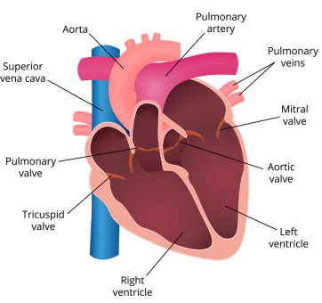

# Automatic segmentation of Left Ventricle in heart using hybrid approach

## Executable File
Link to executable file (for Ubuntu): https://drive.google.com/file/d/1QV_SJl5ikvbxa1Ck75qKnBAoV_62Aivq/view?usp=sharing

## What this Project is about?
Left Ventricle is an integral part of the heart. It pumps blood into the body. Cardiovascular diseases are quite common in modern world. The health of the heart can be studied using left ventricle. Most of the heart diseases can be diagnosed by retrieving important information from systole and diastole operations of heart via effective medical imaging analysis of Left Ventricle (LV). The segmentation of Left Ventricle plays an important role in retrieving the ejection fraction (a parameter which indicates the heart’s health). Since Magnetic Resonance Images (MRI) are noisy and not really perfect, scientific community is always curious to find more efficient, reliable, robust and more accurate segmentation methods to calculate ejection fraction.
 In this project, a combination of smoothing algorithm, K-means algorithm and border following algorithm is implemented.
 

### Index Terms
K-means, Python, Border Following Algorithm, Left Ventricle, Adaptive Smoothing, Clustering, Hough Transform.

## Anatomy of Heart
The heart is made up of four chambers: two upper chambers known as the left atrium and right atrium and two lower chambers called the left and right ventricles. These are shown in following figure.

The left ventricle is considered an important part of the cardiovascular system. It is thought off as a pump that supplies blood to the body. The mass of the left ventricle, as estimated by magnetic resonance imaging, averages 143 g± 38. 4 g, with a range of 87 – 224 g. 
Another important thing to discuss are the two phases of the cardiac cycle. They are called Systole and Diastole. They occur as the heart beats, pumping blood through a system of blood vessels that carry blood to every part of the body. Systole occurs when the heart contracts to pump blood out, and diastole occurs when the heart relaxes after contraction. 
## What is Ejection Factor?
Ejection fraction (EF) refers to how well your left ventricle (or right ventricle) pumps blood with each heart beat. The ejection fraction can be calculated as follows:

